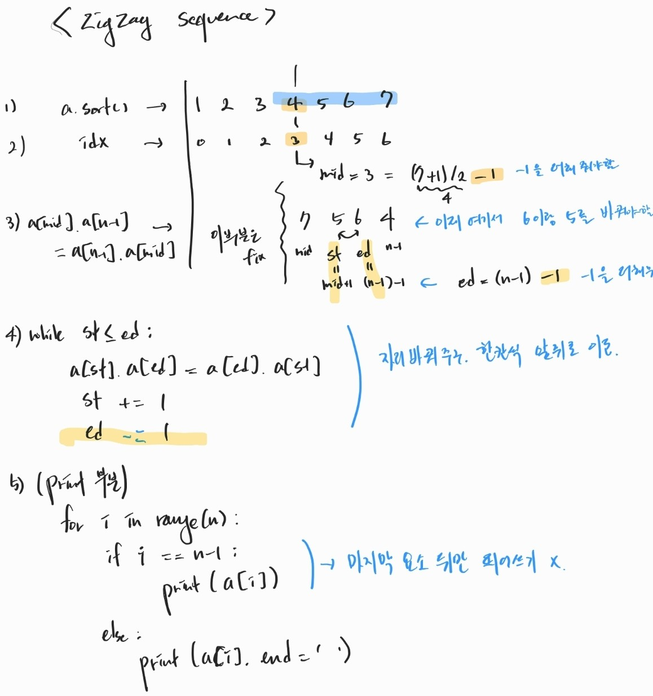

# preparation kit 3

## [Zigzag sequence - debug](https://www.hackerrank.com/challenges/one-week-preparation-kit-zig-zag-sequence/problem?isFullScreen=true&h_l=interview&playlist_slugs%5B%5D=preparation-kits&playlist_slugs%5B%5D=one-week-preparation-kit&playlist_slugs%5B%5D=one-week-day-three)

```python
def findZigZagSequence(a, n):
    a.sort()
    mid = int((n + 1)/2) - 1 # first change -1
    a[mid], a[n-1] = a[n-1], a[mid]

    st = mid + 1
    ed = n - 1 - 1 # second change -1
    while(st <= ed):
        a[st], a[ed] = a[ed], a[st]
        st = st + 1
        ed = ed - 1 # third chang -1

    for i in range (n):
        if i == n-1:
            print(a[i])
        else:
            print(a[i], end = ' ')
    return

test_cases = int(input())
for cs in range (test_cases):
    n = int(input())
    a = list(map(int, input().split()))
    findZigZagSequence(a, n)
```

### 손으로 직접 풀기



- hacker rank에 몇안되는 디버그 문제
- 첫번째 부분은 안건드리고 뒷부분의 index만 맞춰가면 쉬운 문제이다.

## [Tower Breakers](https://www.hackerrank.com/challenges/one-week-preparation-kit-tower-breakers-1/problem?isFullScreen=true&h_l=interview&playlist_slugs%5B%5D=preparation-kits&playlist_slugs%5B%5D=one-week-preparation-kit&playlist_slugs%5B%5D=one-week-day-three&h_r=next-challenge&h_v=zen)

```python
# The function is expected to return an INTEGER.
# The function accepts following parameters:
#  1. INTEGER n : the number of towers
#  2. INTEGER m : the height of each tower
#  return : the winner of the game

def towerBreakers(n, m):
    return 2 - ((m > 1) and (n % 2))
```

### Nim game

- [stack overflow](https://stackoverflow.com/questions/41643198/tower-breakers-nim-game-variation-with-divisors)
- point는 타원가 두 개라는 것. 그래서 player1이 (첫번째 타워를 1로 만들지 않으면) player2는 player1의 행동을 따라한다.

## [Caesar Cipher](https://www.hackerrank.com/challenges/one-week-preparation-kit-caesar-cipher-1/problem?isFullScreen=true&h_l=interview&playlist_slugs%5B%5D=preparation-kits&playlist_slugs%5B%5D=one-week-preparation-kit&playlist_slugs%5B%5D=one-week-day-three)

```python
# The function is expected to return a STRING
# The function accepts following parameters
# 1. STRING s
# 2. INTEGER k
# return ciphered string = result
def caesarCipher(s, k):
    # Write your code here
    from string import ascii_lowercase
    alpha = ascii_lowercase
    pos = {c:i for i,c in enumerate(alpha)}
    result = []

    for c in s:
        cl = c.lower()
        if cl in alpha:
            new_idx = (pos[cl]+k) % len(alpha) #26
            result.append(alpha[new_idx] if c.islower() else alpha[new_idx].upper())
        else:
            result.append(c)
    return "".join(result)
```

- 알파벳은 26자리다.
- from string import ascii_lowercase, ascii_letters, ascii_uppercase, 등으로 바로 가져오는게 가능하다.
- [string method](https://docs.python.org/ko/3/library/stdtypes.html#string-methods) 스트링 모듈의 메소드에 islower같은것도 이용할 줄 알면 좋다.

## [Palindrome Index](https://www.hackerrank.com/challenges/palindrome-index/problem)

```python

```
