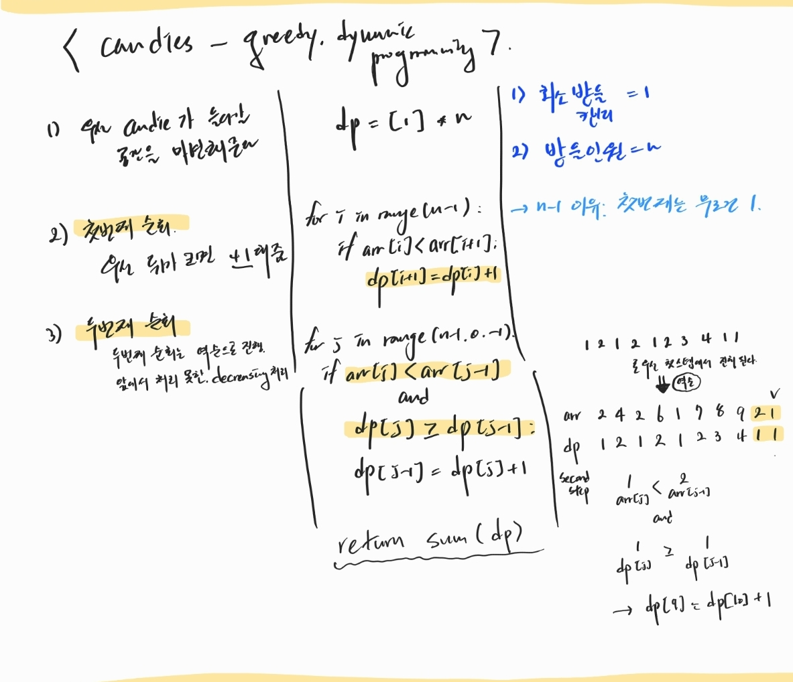

# [Candies](https://www.hackerrank.com/challenges/candies/problem?isFullScreen=true)

## codes

```python
# The function is expected to return a LONG_INTEGER.
# The function accepts following parameters:
#  1. INTEGER n
#  2. INTEGER_ARRAY arr
# return : minimum amount of candies that she must buy

def candies(n, arr):
    dp = [1]*n

    for i in range(n-1):
        if arr[i]<arr[i+1]:
            dp[i+1] = dp[i] + 1
    print('first step :',dp)

    for j in range(n-1,0,-1):
        if arr[j]<arr[j-1] and dp[j]>=dp[j-1]:
            dp[j-1] = dp[j] + 1
    print("second step :",dp)
    return sum(dp)
```

## 손으로 풀기

<p align="center">
    
</p>

- task를 둘로 나눠서 생각해야 한다. up하는 것은 첫번째 step에서 다운하는 것은 두번째 스텝에서 전담한다.
- 두 번째에서 무조건 -= 1 로 내리는 것이 아니라 최소한의 캔디갯수를 구해야하기 때문에 조건 설정을 잘 해줘야한다.
